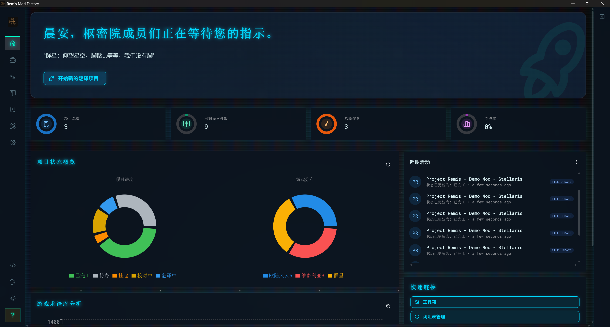
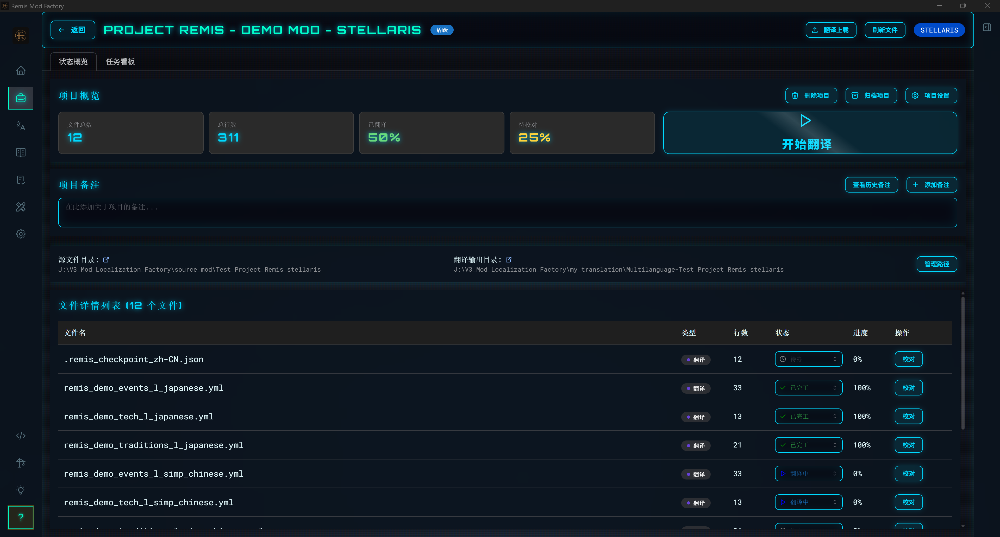
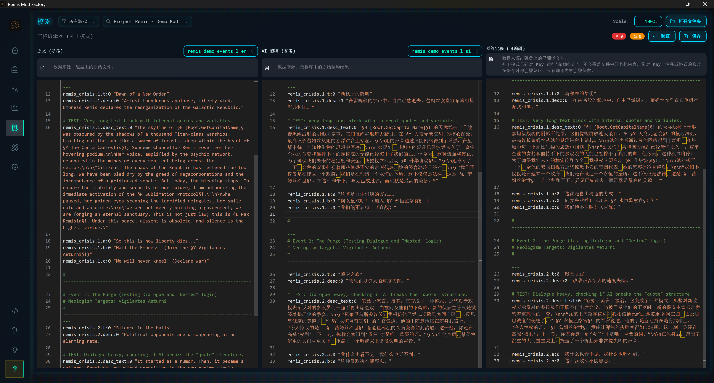
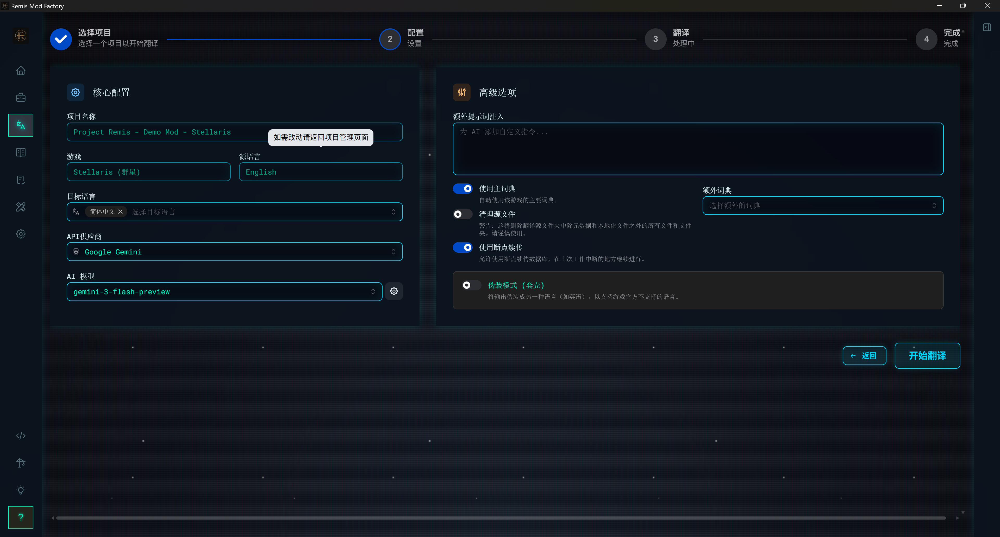

<div align="center">

  

  <h1>Project Remis</h1>
  <strong>P社Mod本地化工厂 (Paradox Mod Localization Factory)</strong>

  <p>
    <a href="https://github.com/Drlinglong/Remis/releases/latest"></a>
    
    
  </p>

  <p>
    <a href="README.md"></a>
    <a href="README_EN.md"></a>
  </p>

</div>

> **告别复制粘贴，拥抱自动化。** 一款为 P社游戏 Mod 打造的 AI 驱动本地化桌面应用，让翻译不再成为门槛。

<p align="center">
  
</p>

---

## ✨ 功能亮点

### 🏗️ 以项目为核心的工作流
告别 CLI 时代的繁琐操作！全新的桌面应用采用**项目管理**模式——创建项目、导入 Mod、一键翻译，所有进度自动追踪。

<p align="center">
  
</p>

### 📚 强大的词典管理系统
内置智能词典，让 AI 像老玩家一样精准地翻译游戏术语。支持**拼音搜索、模糊匹配、缩写识别**，并可跨游戏管理多套词典。

<p align="center">
  
</p>

### ✏️ 专业的校对工作区
翻译完成后，进入**并排对照**的校对模式。AI 初稿自动归档，方便你精修润色每一行文本。

<p align="center">
  
</p>

### 🛠️ 实用工具箱
内置**封面图制作器**等实用工具，更多功能持续开发中！

<p align="center">
  
</p>

### ⚙️ 灵活的翻译配置
支持多款主流 AI 服务：**Gemini、OpenAI、DeepSeek、Grok、Ollama、NVIDIA NIM、OpenRouter** 等。5 款精美主题任你选择。

<p align="center">
  
</p>

---

## 📥 下载与安装

得益于全新的 **Tauri** 打包技术，安装变得前所未有的简单：

1. 📦 从 [Releases 页面](https://github.com/Drlinglong/Remis/releases/latest) 下载最新的 **安装包** (`.exe`)
2. 🖱️ 双击运行，按照安装向导完成安装
3. 🚀 启动应用，跟随**内置引导教程**完成 API 配置

> **💡 温馨提示**
> 
> 本工具是 AI 翻译的"搬运工"，需要你自行准备 API 密钥。
> 首次启动时，应用会引导你选择 AI 服务（如 Gemini、OpenAI 等）并输入 API Key。
> 
> **⚠️ 使用 API 可能产生费用，请妥善保管密钥！**

---

## 🚀 快速开始

应用内置了**交互式引导教程**，会一步步带你完成：

1. **配置 AI 服务** — 选择翻译引擎，输入 API 密钥
2. **创建翻译项目** — 导入 Mod 文件夹，选择游戏类型
3. **启动翻译** — 配置源语言和目标语言，点击开始
4. **校对精修** — 在校对工作区审阅并完善译文
5. **一键部署** — 将翻译成果部署到游戏目录

> 应用内置了 **3 个演示 Mod**（群星、维多利亚 3、EU5），你可以直接用它们来体验完整的翻译流程！

---

## 🎮 在游戏中启用 Mod

完成翻译后，你需要在游戏中启用本地化 Mod：

1. 打开 `my_translation` 文件夹，找到生成的本地化包（如 `zh-CN-你的Mod名`）
2. 将这个文件夹复制到游戏的 `mod` 目录：
   - **维多利亚3**: `C:\Users\你的用户名\Documents\Paradox Interactive\Victoria 3\mod`
   - **群星**: `C:\Users\你的用户名\Documents\Paradox Interactive\Stellaris\mod`
   - **钢铁雄心4**: `C:\Users\你的用户名\Documents\Paradox Interactive\Hearts of Iron IV\mod`
   - **十字军之王3**: `C:\Users\你的用户名\Documents\Paradox Interactive\Crusader Kings III\mod`
3. 在游戏启动器的"播放集"中，同时启用**原 Mod** 和**汉化 Mod**
4. **关键一步**：确保**汉化 Mod** 的加载顺序在原 Mod **之下**

> 💡 应用也提供了**一键部署**功能，可以自动完成上述步骤。

---

## ❓ 故障排除

| 问题 | 解决方案 |
|------|----------|
| **翻译不生效** | 检查汉化 Mod 的加载顺序是否在原 Mod **之下** |
| **原 Mod 有假本地化文件** | 删除原 Mod `localization` 目录下除原语言外的其他语言文件夹 |
| **API 报错** | 检查 API Key 是否正确、账户余额是否充足 |
| **翻译质量不佳** | 尝试在词典管理器中添加专业术语，或在翻译时输入 Mod 主题描述 |

更多问题请参阅 [常见问题 (FAQ)](docs/zh/user-guides/faq.md)。

> [!IMPORTANT]
> **🛑 关于“假本地化”（假中文）与翻译失效**
> 
> 如果汉化 Mod 加载后不生效，最常见的原因是原 Mod 包含了“假本地化文件”。
> 
> **什么是假本地化？**
> 许多 Mod 作者为了让所有语言的玩家都能运行 Mod（防止出现乱码 Key），会把英文文件复制一份并重命名为 `simp_chinese`、`french` 等。这就导致即使你加载了汉化 Mod，游戏也会优先读取原 Mod 里的这些“假中文”文件。
> 
> **如何解决？**
> 1. 打开原 Mod 目录：`SteamLibrary\steamapps\workshop\content\[游戏ID]\[ModID]\localization`
> 2. **删除除原语言（如 english）以外的所有文件夹**。
> 3. *或者：如果您使用本工具的“一键部署”并选择覆盖模式，可以自动覆盖这些文件。*

---

## 📖 词典系统

### 工作原理
词典是一份"游戏术语对照表"。在翻译前，我们会把这份对照表交给 AI，让它在遇到特定术语时严格按照规定翻译。

**举例：**
- ❌ 没有词典：AI 可能把 `convoy` 翻译成"护航"、"车队"或"护卫队"
- ✅ 有了词典：AI 会统一翻译为"船队"

### 词典位置
你可以在应用的**词典管理器**中直接编辑，或手动修改以下文件：
- **Victoria 3**: `data/glossary/victoria3/glossary.json`
- **Stellaris**: `data/glossary/stellaris/glossary.json`

### 词典来源致谢
- **Victoria 3**: 维多利亚3 汉化 更新V1.2、Morgenröte 汉语、Better Politics Mod 简中汉化、牛奶汉化
- **Stellaris**: 鸽组汉化词典、Shrouded Regions 汉化词典、L网群星 mod 汉化集词典

---

## 🏛️ 项目架构

本项目采用 **Tauri + React + Python** 技术栈构建，实现了桌面级用户体验与强大的 AI 翻译引擎的完美结合。

```
remis-mod-factory/
├── src-tauri/                     # [桌面外壳] Tauri/Rust 桌面应用框架
│
├── scripts/
│   ├── react-ui/                  # [前端界面] React + Mantine UI
│   │   ├── src/
│   │   │   ├── pages/             # 页面组件 (项目管理/词典/校对/工具...)
│   │   │   ├── components/        # 可复用 UI 组件
│   │   │   └── hooks/             # 自定义 React Hooks
│   │   └── ...
│   │
│   ├── web_server.py              # [后端服务] FastAPI Web 服务器
│   ├── routers/                   # API 路由层
│   ├── services/                  # 业务服务层
│   │
│   ├── core/                      # [核心引擎] 可复用的底层功能模块
│   │   ├── api_handler.py         # AI API 处理器工厂
│   │   ├── gemini_handler.py      # Google Gemini 接口
│   │   ├── openai_handler.py      # OpenAI 接口
│   │   ├── glossary_manager.py    # 词典管理器
│   │   ├── file_parser.py         # P社 YML 文件解析器
│   │   └── ...
│   │
│   └── workflows/                 # [工作流] 翻译业务流程
│       └── initial_translate.py   # 初始翻译工作流
│
└── data/                          # [数据] 词典、配置、缓存
    ├── glossary/                  # 游戏词典
    └── remis.sqlite            # 本地数据库
```

> 想深入了解技术细节？请查阅 [开发者文档](docs/documentation-center.md)。

---

## 🤝 贡献与反馈

这是一个在社区反馈中不断成长的开源项目。欢迎提交 Issue、PR 或任何形式的建议！

---

## 📜 许可协议

本项目采用**双许可证模式**：

1. **代码部分** (`.py`, `.jsx`, `.rs` 等源代码)  
   采用 **[AGPL-3.0](https://www.gnu.org/licenses/agpl-3.0.html)**

2. **数据与文档部分** (词典、`.md` 文档等)  
   采用 **[CC BY-NC-SA 4.0](https://creativecommons.org/licenses/by-nc-sa/4.0/deed.zh-hans)**

### ❤️ 致谢

如果你使用本工具制作了 Mod 汉化并上传到创意工坊，欢迎在描述中署名并附上仓库链接：

**`https://github.com/Drlinglong/Remis`**

---

<div align="center">
  <i>Roma Invicta!</i> 🦅
</div>
