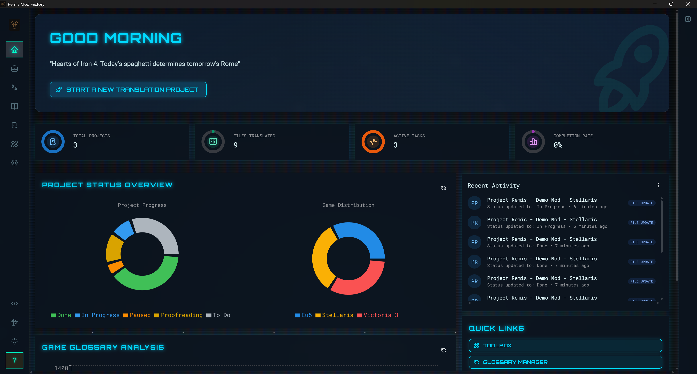
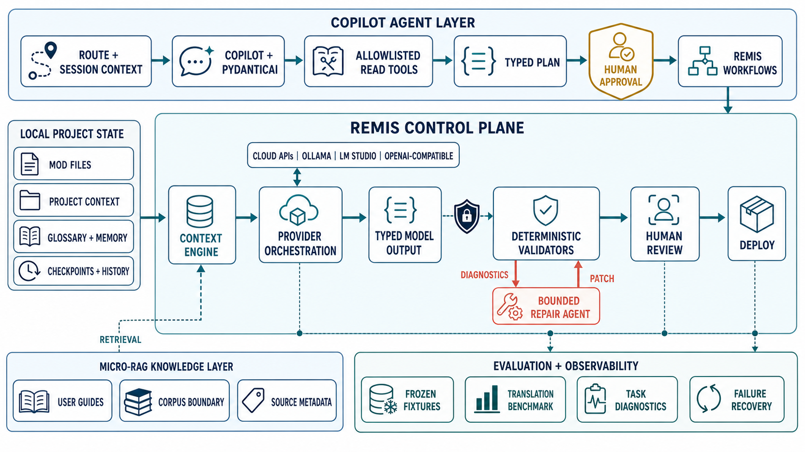
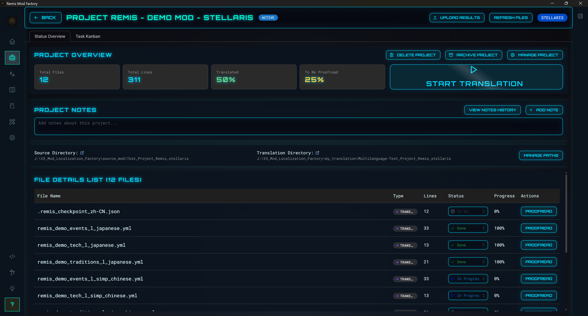
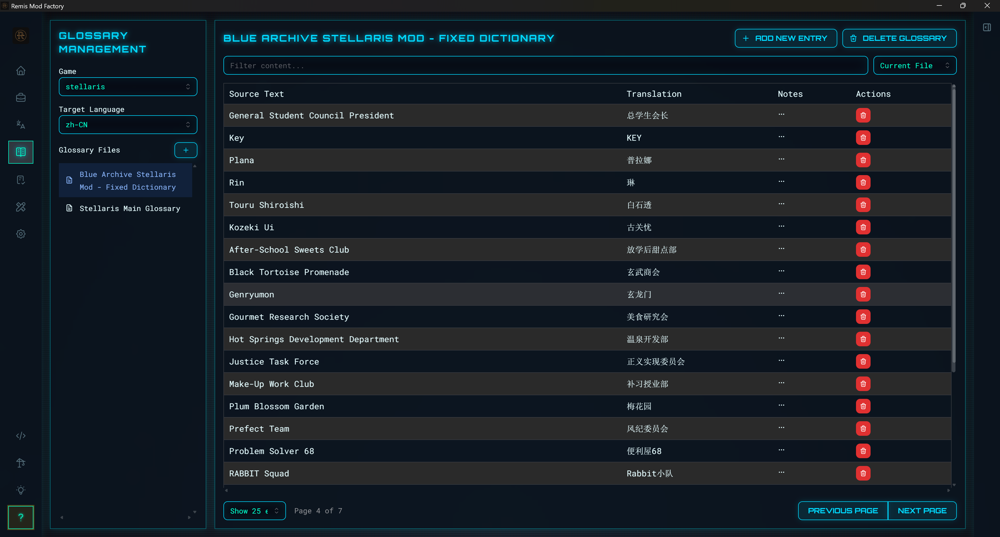
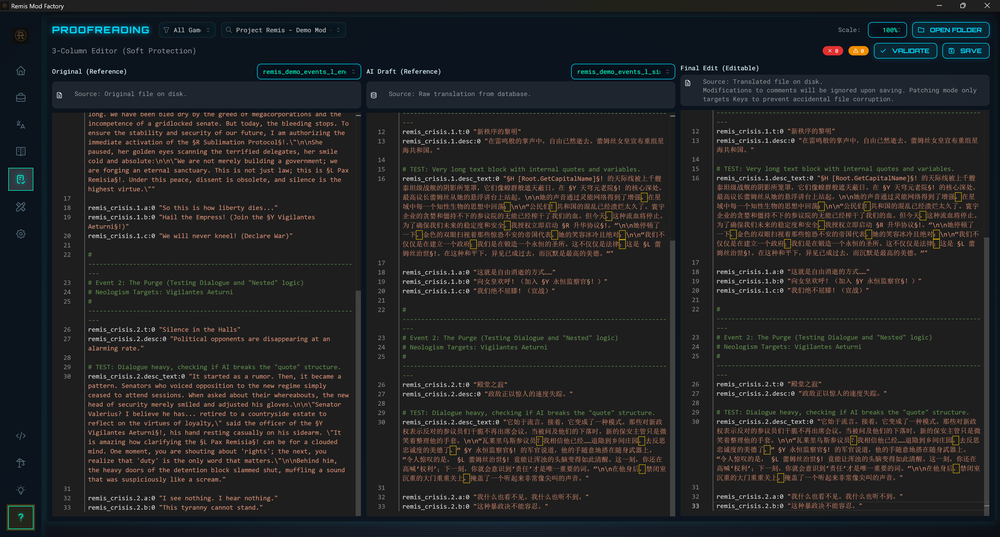
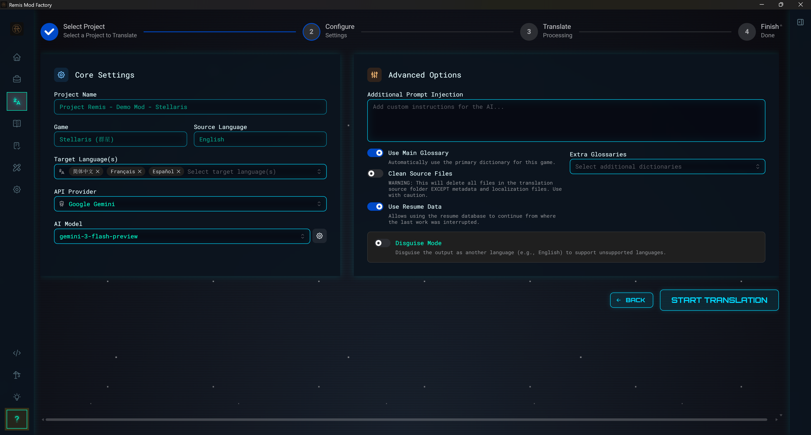

<div align="center">

  

  <h1>Project Remis</h1>
  <h3>The operating system for AI localization.</h3>

  <p>
    An open-source, AI-native desktop system that turns Paradox mod files into
    glossary-aware, validated, reviewable localization.
  </p>

  <p>
    <a href="https://github.com/Drlinglong/Remis/releases/latest"></a>
    <a href="https://github.com/Drlinglong/Remis/releases"></a>
    <a href="https://github.com/Drlinglong/Remis/stargazers"></a>
    
  </p>

  <p>
    
    
    
    
    
  </p>

  <p>
    <a href="#ai-engineering"><strong>AI Engineering</strong></a> ·
    <a href="#approval-gated-agent-system"><strong>Agent System</strong></a> ·
    <a href="#retrieval-augmented-generation--context-engineering"><strong>RAG & Context</strong></a> ·
    <a href="https://github.com/Drlinglong/Remis/releases/latest"><strong>Download</strong></a> ·
    <a href="docs/documentation-center.md"><strong>Documentation</strong></a>
  </p>

  <p>
    <a href="README_ZH.md">简体中文</a> ·
    <a href="README.md">English</a> ·
    <a href="README_RU.md">Русский</a>
  </p>

</div>

---

Remis is not a thin prompt wrapper. It is a full localization control plane for parsing game files, assembling project and terminology context, orchestrating cloud or local models, validating untrusted model output, repairing failures, preserving translation memory, and keeping a human in authority before deployment.

Project files, glossaries, checkpoints, translation history, and review state are managed on the user's machine. Inference is provider-flexible: Remis can use commercial APIs, Ollama, LM Studio, vLLM, or other OpenAI-compatible endpoints.

<p align="center">
  <a href="https://github.com/Drlinglong/Remis/releases/latest"><strong>Download for Windows</strong></a>
  &nbsp;&nbsp;·&nbsp;&nbsp;
  <a href="docs/zh/user-guides/getting-started.md"><strong>Beginner Guide</strong></a>
  &nbsp;&nbsp;·&nbsp;&nbsp;
  <a href="https://github.com/Drlinglong/Remis/issues/132"><strong>Agent Roadmap</strong></a>
</p>

<p align="center">
  
</p>

## AI Engineering

Remis treats localization as a stateful AI engineering problem, not a single model call.

| System capability | Engineering evidence |
|---|---|
| **LLM orchestration** | Provider abstraction across hosted APIs and local OpenAI-compatible runtimes, with configurable batching, concurrency, RPM limits, retries, and resumable execution |
| **Context engineering** | Project metadata, mod description, global and game glossaries, translation memory, parent context, validator diagnostics, and task state are assembled at the point of use |
| **Structured generation** | Typed Pydantic/PydanticAI contracts, schema validation, native function calling, constrained tool selection, provider response parsing, and explicit failure propagation |
| **Agentic AI workflows** | A localhost Agent API for Codex plus an in-development Copilot architecture with model-selected read tools, typed workflow planning, approval-gated execution, persistent sessions, and task handoff |
| **Reliability layer** | Deterministic Paradox-format validators, repair loops, checkpoint recovery, incremental reuse, WebSocket task recovery, and human review |
| **LLMOps, evaluation & observability** | Frozen translation and repair fixtures exercise production prompts, glossary injection, parsers, validators, latency, structured-output failures, and over-editing behavior |
| **Desktop product engineering** | Tauri 2 + React 19 + FastAPI + SQLite, packaged as a real Windows application rather than a notebook or hosted demo |

### System architecture

<p align="center">
  
</p>

The trust boundary is deliberate: models may propose, translate, classify, and repair, but Remis owns file access, argument validation, workflow execution, and every write.

## Approval-gated Agent System

Remis 3.0.7 ships a localhost Agent API and a repository-local operator Skill so Codex can inspect, plan, validate, and monitor localization through Remis instead of bypassing the product with direct filesystem edits.

1. **Preflight** — the Agent checks the running Remis version, provider readiness, and the latest official GitHub Release before starting a workflow.
2. **Inspect and plan** — read-only endpoints return bounded project state, validation summaries, persisted job state, and explicit `allowed_actions`.
3. **Approve** — paid translation, model-backed repair, export, deployment, and overwrite remain blocked until the user approves the exact action.
4. **Execute and verify** — Remis owns file access and workflow execution; the Agent reports completion only from persisted state, validation evidence, and output paths.

This is bounded agency, not invisible autonomy. Read operations are allowlisted. Write operations remain server-owned, explicit, expiring, and approval-gated.

The in-product Remis Copilot and its PydanticAI planner are an engineering preview. Their UI and packaged API route are intentionally hidden in 3.0.7 while startup hardening and end-to-end validation continue; they are planned for the next release.

### Use Remis with Codex

1. Start Remis and open the [Remis for Codex page](https://drlinglong.github.io/Remis/codex/).
2. Copy the install prompt into Codex.
3. Configure cloud credentials only in **Remis Settings > API Settings**. Never paste an API key into Agent chat. A selected local provider may be keyless.
4. Follow the approval-gated workflow exposed by Remis at `http://127.0.0.1:1453/api/agent`.

Developer entry points:

- [Agent API quickstart](docs/en/developer/agent-api-quickstart.md)
- [Remis Agent Skill](.agents/skills/remis-agent/SKILL.md)
- [OpenAI Build Week](https://openai.com/zh-Hans-CN/build-week/)

## Retrieval-Augmented Generation & Context Engineering

Remis has a defined **Micro-RAG** architecture for product help and localization support. The knowledge boundary separates three different context domains:

- **User knowledge corpus** — versioned guides, troubleshooting, provider setup, deployment, glossary, proofreading, and error documentation.
- **Agent operation contract** — tool descriptions, allowed actions, approval rules, and refusal boundaries.
- **Project context** — the user's selected mod, files, language pair, terminology, checkpoints, and task state.

The hidden Copilot preview already performs model-directed retrieval over allowlisted help packs, attaches source metadata, and combines it with route and session context. The next retrieval adapter adds vector search over the curated user corpus without turning source code, secrets, developer notes, or arbitrary user files into an undifferentiated knowledge base.

That boundary matters more than bolting a vector database onto the product. Remis is designed so retrieval improves grounding while deterministic validators and human approval remain authoritative.

| Knowledge layer | Status |
|---|---|
| Model-selected help packs and source-aware answers | **Engineering preview; hidden in 3.0.7** |
| Route context, session memory, and bounded project read tools | **Engineering preview; hidden in 3.0.7** |
| Curated Micro-RAG corpus contract and indexing boundaries | **Architecture complete** |
| Vector retrieval and retrieval evaluation over the user corpus | **Next adapter** |
| Autonomous write access to arbitrary user files | **Explicitly out of scope** |

## Evaluation-first AI

Model quality claims are tested against a reproducible translation-quality benchmark, not inferred from a few attractive screenshots.

The benchmark runs Remis production prompt construction, glossary injection, structured parsing, repair prompts, marker recovery, and game-specific validators against frozen translation and repair cases. It records:

- structural-output failures separately from API failures;
- terminology and contextual disambiguation;
- placeholder, variable, color-tag, quote, and line-break integrity;
- repair success and validator clear rate;
- whether a repair model damages text that was already correct;
- generation latency and model/runtime configuration.

The first local-model study evaluated four models on seven frozen cases and exposed meaningful differences between language quality, formatting stability, latency, contextual glossary use, and repair restraint. See the [benchmark design](docs/zh/developer/translation_quality_benchmark.md) and [first engineering report](docs/zh/developer/translation_quality_benchmark_report_2026-07-15.md).

## Core Workflows

### Project lifecycle

Projects make localization state explicit: source assets, language pairs, glossaries, checkpoints, generated files, review state, and deployment history belong to one auditable workspace.

<p align="center">
  
</p>

### Incremental translation and memory reuse

When a mod updates, Remis compares source state, reuses approved translations, preserves translation memory, and sends only changed or missing work back through the model pipeline.

<p align="center">
  
</p>

### Agentic validation and repair

Broken entries become diagnostic context. The repair agent receives the source, current translation, glossary and validator report, proposes a bounded patch, and loops through verification before a human reviews the result.

<p align="center">
  
</p>

## Product Capabilities

| Capability | What the user gets |
|---|---|
| **Project-centric localization** | Import a mod, create a project, translate, review, track updates, and deploy from one desktop workspace |
| **Provider-flexible inference** | Use Gemini, OpenAI, Anthropic, DeepSeek, Grok, Qwen, NVIDIA NIM, Ollama, LM Studio, vLLM, and other compatible endpoints |
| **Terminology control** | Global, game, and project glossaries with fuzzy search, phonetic search, abbreviation recognition, and explicit precedence |
| **Professional proofreading** | Side-by-side source/translation review, patch-based editing, history, diagnostics, and human approval |
| **Neologism Tribunal** | Mine source-grounded terminology candidates, review duplicates and meanings, then promote approved terms into project glossaries |
| **Agent Workshop** | Scan localization structure, diagnose format failures, and run bounded repair workflows |
| **Incremental updates** | Detect source changes, reuse approved work, resume interrupted tasks, and avoid retranslating unchanged entries |
| **One-click deployment** | Build and install a localization mod with the load-order rules Paradox games require |
| **International interface** | 11 UI languages across the desktop application |

<table>
  <tr>
    <td width="50%"></td>
    <td width="50%"></td>
  </tr>
  <tr>
    <td align="center"><strong>Project state and progress</strong></td>
    <td align="center"><strong>Context and terminology control</strong></td>
  </tr>
  <tr>
    <td width="50%"></td>
    <td width="50%"></td>
  </tr>
  <tr>
    <td align="center"><strong>Human-in-the-loop review</strong></td>
    <td align="center"><strong>Cloud or local model inference</strong></td>
  </tr>
</table>

## Download and Quick Start

1. Download the latest Windows installer from [GitHub Releases](https://github.com/Drlinglong/Remis/releases/latest).
2. Launch Remis and configure a cloud API or local model endpoint.
3. Create a project and import the source mod folder.
4. Choose the source language, target language, model, glossary, and execution limits.
5. Run translation, review validator findings, proofread the output, and deploy.

Remis includes demo mods for Stellaris, Victoria 3, and Europa Universalis V so the complete workflow can be explored without preparing a project first.

New to mod localization? Start with the [Chinese beginner guide](docs/zh/user-guides/getting-started.md), the [documentation center](docs/documentation-center.md), or the [FAQ](docs/en/user-guides/faq.md).

<details>
<summary><strong>Paradox Launcher load order</strong></summary>

After deployment, enable both the original mod and the generated localization mod in the launcher. The localization mod must load **after** the original mod.

Common mod directories:

- Victoria 3: `Documents\Paradox Interactive\Victoria 3\mod`
- Stellaris: `Documents\Paradox Interactive\Stellaris\mod`
- Hearts of Iron IV: `Documents\Paradox Interactive\Hearts of Iron IV\mod`
- Crusader Kings III: `Documents\Paradox Interactive\Crusader Kings III\mod`

If the original mod ships duplicated "fake localization" folders, use Remis deployment cleanup or follow the [fake-localization guide](docs/zh/user-guides/fake-localization.md).

</details>

## Engineering Stack

```text
Tauri 2 / Rust
└── React 19 + Mantine desktop interface
    └── FastAPI application services
        ├── Agent API + hidden Copilot/PydanticAI preview
        ├── Provider abstraction and prompt/context assembly
        ├── Translation, proofreading, incremental update, and repair workflows
        ├── Paradox parsers, builders, and deterministic validators
        └── SQLite + SQLAlchemy repositories, checkpoints, and task state
```

Useful entry points:

- [`scripts/core/copilot/`](scripts/core/copilot/) — agent planning, context budgets, tools, sessions, actions, and workflow gates
- [`scripts/core/`](scripts/core/) — model handlers, parsing, glossaries, project state, repair, and translation services
- [`scripts/react-ui/src/`](scripts/react-ui/src/) — React desktop product and hidden Copilot preview surfaces
- [`scripts/developer_tools/evaluate_translation_quality.py`](scripts/developer_tools/evaluate_translation_quality.py) — reproducible translation/repair benchmark runner
- [`tests/`](tests/) — backend, workflow, regression, benchmark, and provider contract tests
- [`docs/`](docs/) — user guides, engineering notes, release evidence, and architecture decisions

## Design Principles

- **Model output is untrusted input.** Parse it, validate it, diagnose it, then decide whether it can proceed.
- **Agents propose; the product authorizes.** Tool boundaries, side effects, and approval belong to Remis.
- **Context is a system, not a longer prompt.** Retrieve only the project state, terminology, history, and documentation required for the current decision.
- **Local project control and model location are separate choices.** User state remains managed locally while inference may be cloud-hosted or local.
- **Human review is part of the architecture.** Quality-sensitive localization ends with an accountable reviewer, not a confidence score.
- **Evaluation must be reproducible.** Model, provider, prompt, context, glossary, decoding, validators, repair policy, cost, and latency form one versioned recipe.

## Contributing

Issues, pull requests, evaluation cases, provider integrations, glossary improvements, and documentation contributions are welcome. Start with the [documentation center](docs/documentation-center.md) and open an [issue](https://github.com/Drlinglong/Remis/issues) before proposing a large workflow change.

## License

Remis uses a dual-license model:

1. Source code (`.py`, `.jsx`, `.rs`, and related files): [AGPL-3.0](https://www.gnu.org/licenses/agpl-3.0.html)
2. Data and documentation (glossaries, Markdown, and related assets): [CC BY-NC-SA 4.0](https://creativecommons.org/licenses/by-nc-sa/4.0/)

Glossaries include community knowledge from Victoria 3 Localization, Morgenröte Chinese, Better Politics Mod CN, Milk Localization, Pigeon Group, Shrouded Regions, and the L-Network Stellaris Mod Collection.

If Remis helps you publish a localization on the Steam Workshop, a mention and link back to `https://github.com/Drlinglong/Remis` are appreciated.

---

<div align="center">
  <strong>Built for translators who want control, and for AI systems that need constraints.</strong>
  <br>
  <i>Roma Invicta!</i> 🦅
</div>
