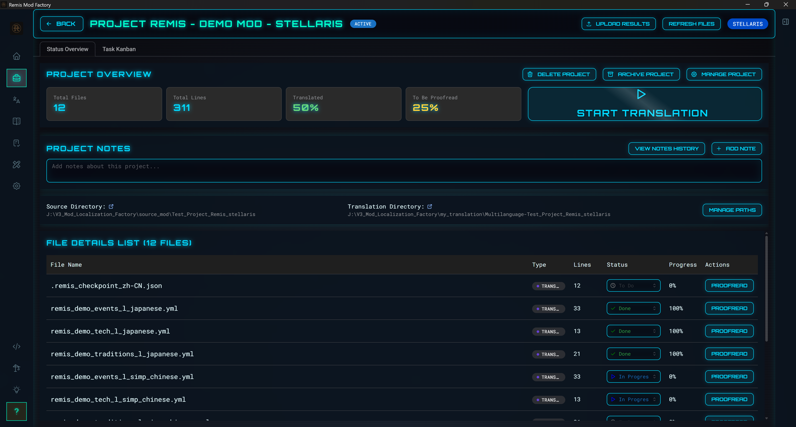
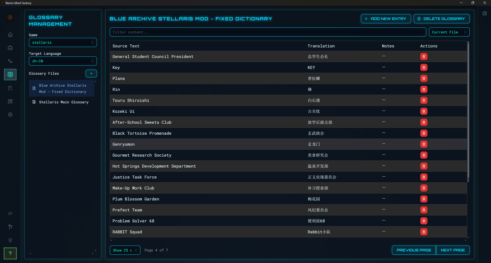
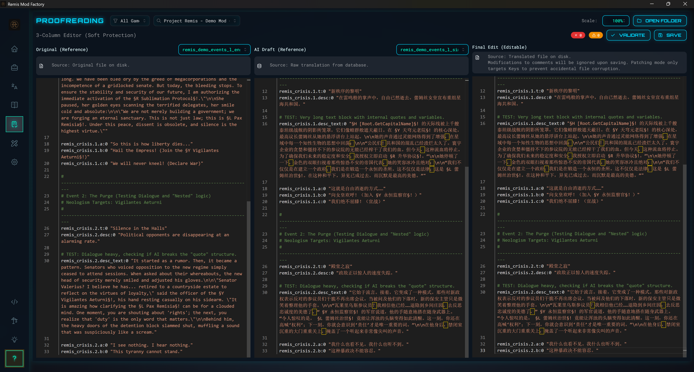
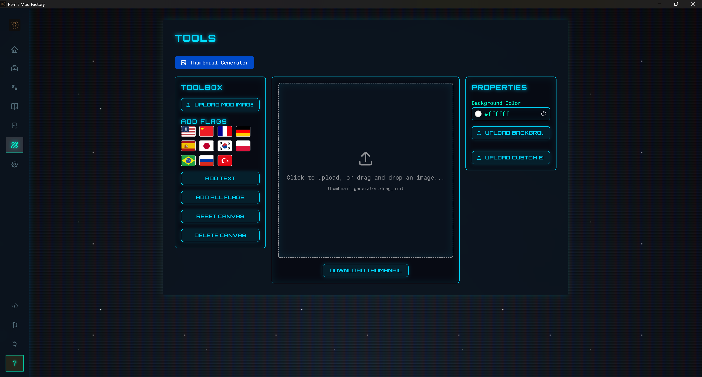
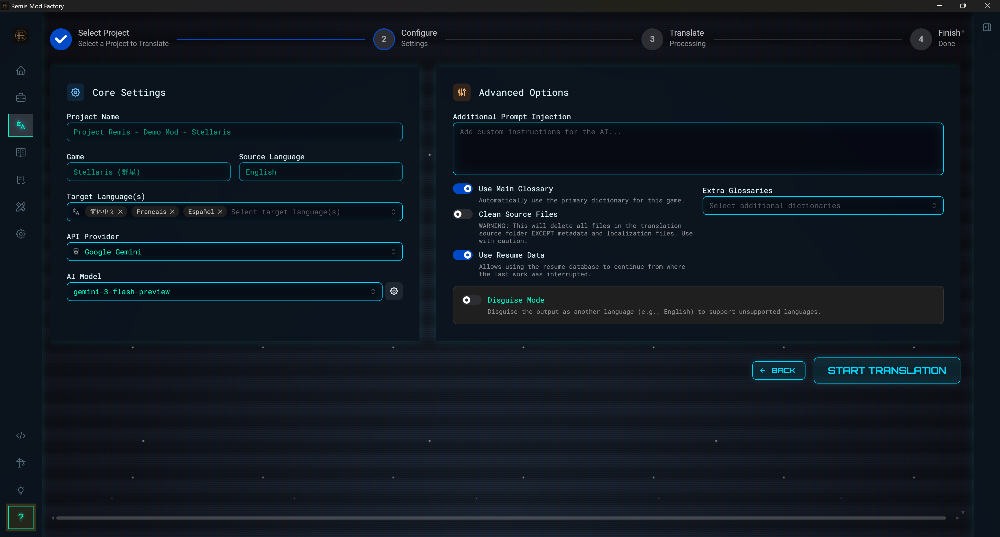

<div align="center">

  

  <h1>Project Remis</h1>
  <strong>Paradox Mod Localization Factory</strong>

  <p>
    <a href="https://github.com/Drlinglong/Remis/releases/latest"></a>
    
    
  </p>

  <p>
    <a href="README.md"></a>
    <a href="README_EN.md"></a>
  </p>

</div>

> **Say goodbye to copy-pasting, embrace automation.** An AI-powered desktop application for localizing Paradox game mods — making translation accessible to everyone.

<p align="center">
  
</p>

---

## ✨ Feature Highlights

### 🏗️ Project-Centric Workflow
Say goodbye to the CLI era! The new desktop app adopts a **project management** approach — create a project, import your mod, translate with one click, and track all progress automatically.

<p align="center">
  
</p>

### 📚 Powerful Glossary Management
Built-in intelligent glossary system ensures AI translates game terminology like a veteran player. Supports **phonetic search, fuzzy matching, and abbreviation recognition**, with cross-game glossary management.

<p align="center">
  
</p>

### ✏️ Professional Proofreading Workspace
After translation, enter a **side-by-side comparison** proofreading mode. AI drafts are automatically archived for easy review and refinement.

<p align="center">
  
</p>

### 🛠️ Utility Toolbox
Built-in tools like **Cover Image Maker**, with more features coming soon!

<p align="center">
  
</p>

### ⚙️ Flexible Translation Configuration
Supports multiple AI providers: **Gemini, OpenAI, DeepSeek, Grok, Ollama, NVIDIA NIM, OpenRouter**, and more. Choose from 5 beautiful themes.

<p align="center">
  
</p>

---

## 📥 Download & Install

Thanks to the new **Tauri** packaging technology, installation is simpler than ever:

1. 📦 Download the latest **installer** (`.exe`) from the [Releases page](https://github.com/Drlinglong/Remis/releases/latest)
2. 🖱️ Double-click to run and follow the installation wizard
3. 🚀 Launch the app and follow the **built-in tutorial** to configure your API

> **💡 Quick Note**
> 
> This tool is an "AI translation porter" — you'll need your own API key.
> On first launch, the app will guide you to select an AI service (e.g., Gemini, OpenAI) and enter your API key.
> 
> **⚠️ API usage may incur costs. Keep your key safe!**

---

## 🚀 Quick Start

The app includes an **interactive guided tutorial** that walks you through:

1. **Configure AI Service** — Select your translation engine and enter API key
2. **Create Translation Project** — Import mod folder, select game type
3. **Start Translation** — Configure source and target languages, click start
4. **Proofread & Refine** — Review and polish translations in the proofreading workspace
5. **One-Click Deploy** — Deploy translations to your game directory

> The app includes **3 demo mods** (Stellaris, Victoria 3, EU5) — try the complete translation workflow immediately!

---

## 🎮 Enable Mod in Game

After translation, you need to enable the localization mod in-game:

1. Open the `my_translation` folder and locate the generated localization package (e.g., `zh-CN-YourModName`)
2. Copy this folder to your game's `mod` directory:
   - **Victoria 3**: `C:\Users\YourUsername\Documents\Paradox Interactive\Victoria 3\mod`
   - **Stellaris**: `C:\Users\YourUsername\Documents\Paradox Interactive\Stellaris\mod`
   - **Hearts of Iron IV**: `C:\Users\YourUsername\Documents\Paradox Interactive\Hearts of Iron IV\mod`
   - **Crusader Kings III**: `C:\Users\YourUsername\Documents\Paradox Interactive\Crusader Kings III\mod`
3. In the game launcher's "Playsets," enable both the **original mod** and the **localization mod**
4. **Crucial step**: Ensure the **localization mod** loads **after** the original mod

> 💡 The app also provides a **one-click deploy** feature that automates these steps.

---

## ❓ Troubleshooting

| Issue | Solution |
|-------|----------|
| **Translation not working** | Ensure localization mod loads **after** the original mod |
| **Original mod has fake localization** | Delete all language folders except the original language in the mod's `localization` directory |
| **API errors** | Verify your API key and check account balance |
| **Poor translation quality** | Add specialized terms in the Glossary Manager, or provide mod theme description |

For more help, see [Frequently Asked Questions (FAQ)](docs/en/user-guides/faq.md).

---

## 📖 Glossary System

### How It Works
The glossary is a "game terminology reference sheet." Before translation, we provide this reference to the AI, ensuring specific terms are translated consistently.

**Example:**
- ❌ Without glossary: AI might translate `convoy` as "escort," "motorcade," or "guard"
- ✅ With glossary: AI consistently translates it as "fleet"

### Glossary Locations
You can edit directly in the **Glossary Manager**, or manually modify:
- **Victoria 3**: `data/glossary/victoria3/glossary.json`
- **Stellaris**: `data/glossary/stellaris/glossary.json`

### Glossary Credits
- **Victoria 3**: Victoria 3 Localization V1.2, Morgenröte Chinese, Better Politics Mod CN, Milk Localization
- **Stellaris**: Pigeon Group Glossary, Shrouded Regions Glossary, L-Network Stellaris Mod Collection

---

## 🏛️ Project Architecture

Built with **Tauri + React + Python**, combining a desktop-class user experience with a powerful AI translation engine.

```
remis-mod-factory/
├── src-tauri/                     # [Desktop Shell] Tauri/Rust desktop framework
│
├── scripts/
│   ├── react-ui/                  # [Frontend] React + Mantine UI
│   │   ├── src/
│   │   │   ├── pages/             # Page components (Projects/Glossary/Proofread/Tools...)
│   │   │   ├── components/        # Reusable UI components
│   │   │   └── hooks/             # Custom React hooks
│   │   └── ...
│   │
│   ├── web_server.py              # [Backend] FastAPI web server
│   ├── routers/                   # API routing layer
│   ├── services/                  # Business service layer
│   │
│   ├── core/                      # [Core Engine] Reusable underlying modules
│   │   ├── api_handler.py         # AI API handler factory
│   │   ├── gemini_handler.py      # Google Gemini interface
│   │   ├── openai_handler.py      # OpenAI interface
│   │   ├── glossary_manager.py    # Glossary manager
│   │   ├── file_parser.py         # Paradox YML file parser
│   │   └── ...
│   │
│   └── workflows/                 # [Workflows] Translation business processes
│       └── initial_translate.py   # Initial translation workflow
│
└── data/                          # [Data] Glossaries, config, cache
    ├── glossary/                  # Game glossaries
    └── database.sqlite            # Local database
```

> Want to dive deeper? Check out the [Developer Documentation](docs/documentation-center.md).

---

## 🤝 Contributing

This is an open-source project that grows with community feedback. Issues, PRs, and suggestions are always welcome!

---

## 📜 License

This project uses a **dual-license model**:

1. **Code** (`.py`, `.jsx`, `.rs`, etc.)  
   Licensed under **[AGPL-3.0](https://www.gnu.org/licenses/agpl-3.0.html)**

2. **Data & Documentation** (glossaries, `.md` files, etc.)  
   Licensed under **[CC BY-NC-SA 4.0](https://creativecommons.org/licenses/by-nc-sa/4.0/)**

### ❤️ Credits

If you use this tool to create mod localizations and upload to the Workshop, we'd appreciate a mention with a link to the repository:

**`https://github.com/Drlinglong/Remis`**

---

<div align="center">
  <i>Roma Invicta!</i> 🦅
</div>
