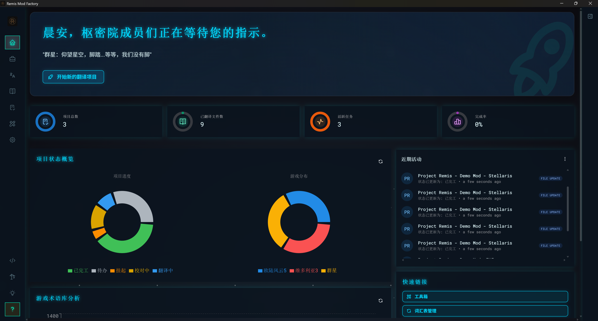
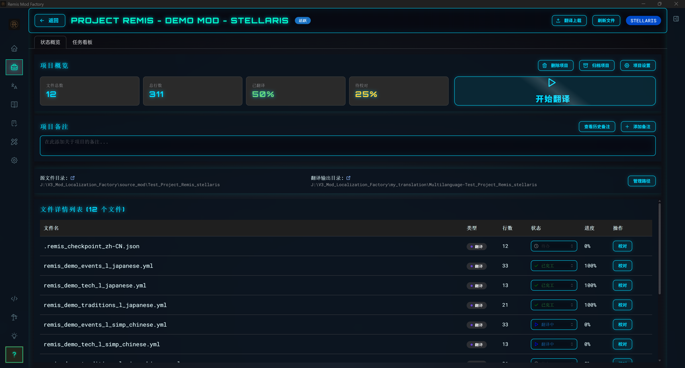
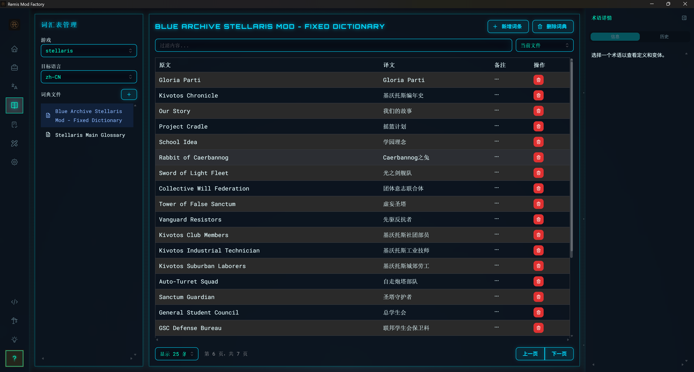
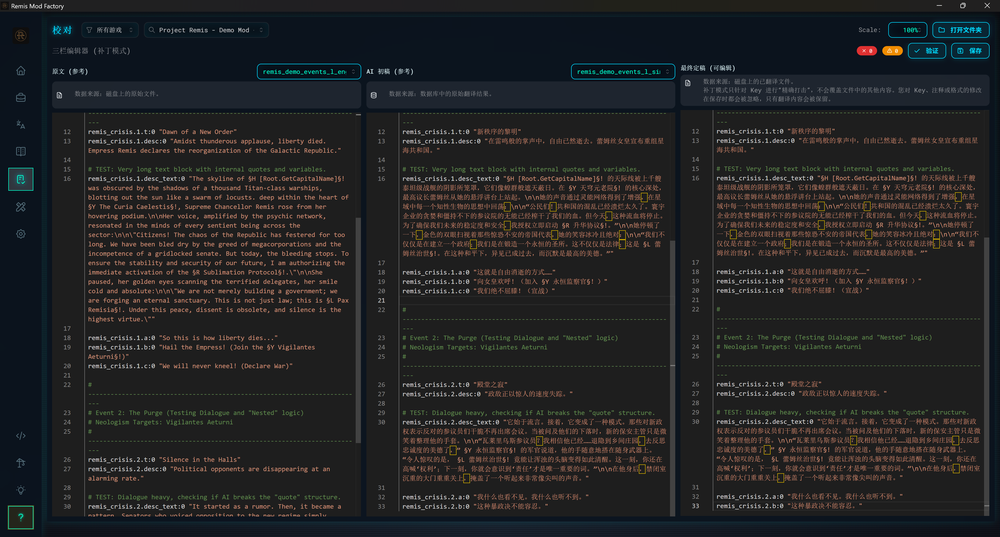
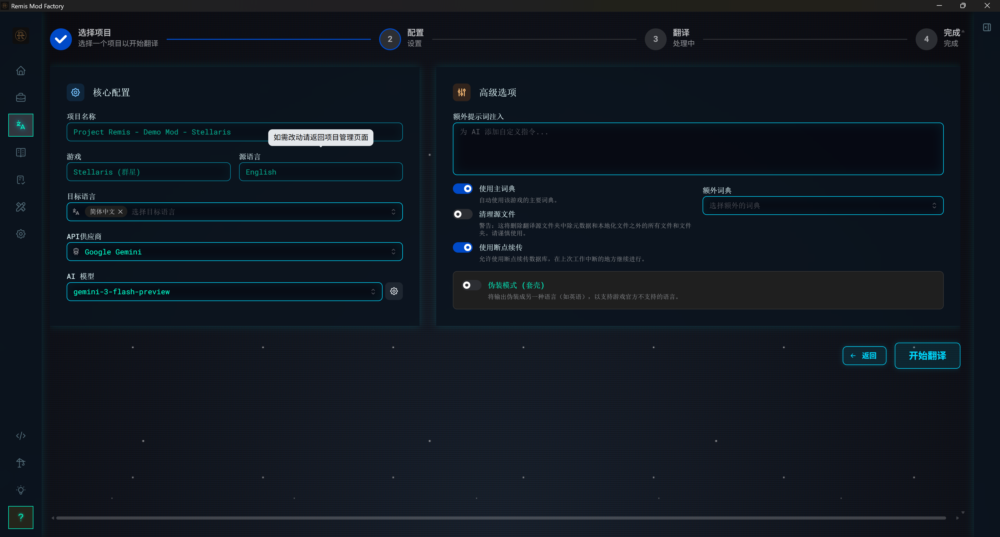

  

  <h1>Project Remis</h1>
  <strong>Фабрика локализации модов Paradox (Paradox Mod Localization Factory)</strong>

  

    
    
    
  

  

    
    
    
  

> **Попрощайтесь с копированием и вставкой, переходите на автоматизацию.** Настольное приложение на базе ИИ, созданное специально для локализации модов к играм Paradox, снижающее порог входа для перевода.

  

---

## ✨ Ключевые особенности

### 🏗️ Рабочий процесс на основе проектов
Забудьте о сложных операциях в командной строке! Новое приложение использует **управление проектами**: создавайте проект, импортируйте мод, переводите в один клик с автоматическим отслеживанием прогресса.

  

### 📚 Мощная система управления словарями (Глоссариями)
Встроенный интеллектуальный словарь позволяет ИИ переводить игровые термины так же точно, как это сделали бы опытные игроки. Поддерживает **поиск по транскрипции (пиньинь), нечеткий поиск, распознавание аббревиатур** и может управлять несколькими словарями для разных игр.

  

### ✏️ Профессиональное рабочее пространство для проверки (вычитки)
После завершения перевода вы переходите в режим вычитки в формате **параллельного сравнения**. Первоначальный черновик ИИ сохраняется, позволяя вам легко доработать и улучшить каждую строку.

  

### 🛠️ Набор полезных инструментов
Встроенный **создатель обложек** и другие полезные инструменты. Еще больше возможностей в разработке!

  

### ⚙️ Гибкие настройки перевода
Поддержка множества популярных ИИ-сервисов: **Gemini, OpenAI, DeepSeek, Grok, Ollama, NVIDIA NIM, OpenRouter** и др. 5 красивых тем интерфейса на выбор.

  

---

## 📥 Скачивание и установка

Благодаря новой технологии комплектования **Tauri** установка стала невероятно простой:

1. 📦 Скачайте последний **установочный пакет** (`.exe`) со [страницы Releases](https://github.com/Drlinglong/Remis/releases/latest)
2. 🖱️ Дважды щелкните файл и следуйте указаниям мастера установки.
3. 🚀 Запустите приложение и следуйте **встроенному интерактивному руководству** для настройки API.

> **💡 Важное примечание**
> 
> Этот инструмент является "посредником" для ИИ-перевода, поэтому вам необходимо подготовить собственный ключ API.
> При первом запуске приложение предложит вам выбрать ИИ-сервис (например, Gemini, OpenAI и т.д.) и ввести ваш ключ API.
> 
> **⚠️ Использование API может быть платным или требовать бесплатной регистрации, пожалуйста, храните свои ключи в безопасности!**

---

## 🚀 Быстрый старт (Руководство "для чайников")

В приложение встроено **интерактивное руководство**, которое шаг за шагом проведет вас через весь процесс:

1. **Настройка ИИ-сервиса** — выберите движок перевода и введите ваш ключ API.
2. **Создание проекта перевода** — импортируйте папку вашего мода и выберите игру.
3. **Запуск перевода** — настройте исходный и целевой языки (например, с английского на русский) и нажмите "Старт".
4. **Проверка и вычитка** — просмотрите и улучшите переведенный текст в рабочем пространстве проверки.
5. **Развертывание в один клик** — экспортируйте готовый перевод в директорию игры.

> В приложении есть **3 встроенных демо-мода** (Stellaris, Victoria 3, EU5), которые вы можете использовать для тестирования полного процесса перевода!

---

## 🎮 Активация модов в игре

После завершения перевода вам нужно включить мод локализации в игре:

1. Откройте папку `my_translation` и найдите сгенерированный пакет локализации (например, `ru-НазваниеВашегоМода`).
2. Скопируйте эту папку в директорию `mod` игры (пути по умолчанию):
   - **Victoria 3**: `C:\Users\ВашеИмя\Documents\Paradox Interactive\Victoria 3\mod`
   - **Stellaris**: `C:\Users\ВашеИмя\Documents\Paradox Interactive\Stellaris\mod`
   - **Hearts of Iron IV**: `C:\Users\ВашеИмя\Documents\Paradox Interactive\Hearts of Iron IV\mod`
   - **Crusader Kings III**: `C:\Users\ВашеИмя\Documents\Paradox Interactive\Crusader Kings III\mod`
3. В лаунчере игры, в разделе "Плейсеты" (Playsets), включите как **оригинальный мод**, так и **мод с переводом**.
4. **Критический шаг**: убедитесь, что **мод с переводом** находится в порядке загрузки **НИЖЕ** оригинального мода.

> 💡 Приложение также имеет функцию **развертывания в один клик** (One-click Deploy), которая может автоматизировать эти шаги.

---

## ❓ Устранение неполадок

| Проблема | Решение |
|------|----------|
| **Перевод не отображается** | Убедитесь, что порядок загрузки мода локализации находится **НИЖЕ** (после) оригинального мода. |
| **Оригинальный мод имеет фиктивные файлы локализации** | Удалите все языковые папки из каталога `localization` оригинального мода, кроме оригинального языка (например, удалите папки `russian`, если переводите с английского). |
| **Ошибка API** | Проверьте, правильный ли у вас ключ API (API Key) и есть ли у вас квота/баланс. |
| **Низкое качество перевода** | Попробуйте добавить специальные термины в Менеджер словарей (Glossary) или добавьте описание тематики мода в настройках перевода. |

Больше информации можно найти в [Часто задаваемых вопросах (FAQ)](docs/zh/user-guides/faq.md) (на китайском/английском).

> [!IMPORTANT]
> **🛑 О проблеме мертвых языков ("Фиктивная локализация") и неработающем переводе**
> 
> Если ваш переведенный мод не работает после активации, наиболее частая причина — "фиктивные файлы локализации" в оригинальном моде.
> 
> **Что это такое?**
> Многие авторы модов, чтобы предотвратить появление нечитаемого текста у пользователей с другими языками интерфейса, копируют английские файлы локализации и переименовывают их в папки `russian`, `simp_chinese`, `french` и т.д. В результате игра отдает приоритет этим "якобы русским" файлам из оригинального мода, игнорируя ваш настоящий перевод.
> 
> **Как это исправить?**
> 1. Откройте директорию оригинального мода: `SteamLibrary\steamapps\workshop\content\[ID_Игры]\[ID_Мода]\localization`
> 2. **Удалите все папки, кроме оригинального языка** (обычно это `english`).
> 3. *В качестве альтернативы: Если вы используете функцию "Развертывание в один клик" в нашем приложении и выбираете режим "Перезапись" (Overwrite), программа может автоматически заменить эти файлы.*

---

## 📖 Система словаря (Глоссарий)

Словарь служит "справочником игровых терминов". Перед переводом мы предоставляем этот список ИИ, чтобы гарантировать, что конкретные термины переводятся согласованно в соответствии с заданными правилами.

Словари можно редактировать напрямую во встроенном **Менеджере словарей** (Glossary Manager).

---

## 🤝 Вклад и обратная связь

Это развивающийся проекты с открытым исходным кодом. Если у вас есть предложения или вы столкнулись с ошибками, пожалуйста, создавайте Issue на GitHub. Поддержка русского языка для интерфейса приложения планируется в будущих обновлениях!

---

## 📜 Лицензия

Этот проект использует **модель двойного лицензирования**:

1. **Исходный код** (`.py`, `.jsx`, `.rs` и т.д.)  
   Лицензируется по **[AGPL-3.0](https://www.gnu.org/licenses/agpl-3.0.html)**

2. **Данные и документация** (Словари, файлы `.md` и т.д.)  
   Лицензируется по **[CC BY-NC-SA 4.0](https://creativecommons.org/licenses/by-nc-sa/4.0/deed.ru)**

### ❤️ Благодарности

Если вы используете этот инструмент для перевода мода и загружаете его в Steam Workshop, пожалуйста, упомяните этот инструмент в описании и предоставьте ссылку на репозиторий:

**`https://github.com/Drlinglong/Remis`**

---

  <i>Roma Invicta!</i> 🦅

