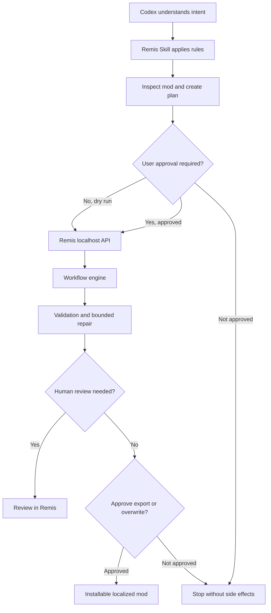

# Remis for Codex: Agent API quickstart

Remis is the reliable execution plane for game localization. Codex is the
natural-language control plane that can inspect a workspace, explain a plan,
call the localhost API, and stop at safety gates.

The Skill is an operator manual. The product remains the Remis desktop
application, FastAPI service, workflow engine, validator, repair system,
project store, and review/export interface.

## Install the operator Skill

From a clone of the official repository, ask Codex:

> Install the latest stable Remis from the official repository, read the
> official Remis Agent Skill, start Remis locally, and verify that its health
> endpoint is ready. After the first launch, briefly explain what an API key is
> used for, then guide me through configuring a model provider and API key in
> Remis Settings → API Settings.

Codex discovers the repository Skill at:

```text
.agents/skills/remis-agent/SKILL.md
```

## Verify the local service

Start the installed desktop application or run `run-dev.bat` from the
repository. The default port is `1453`; respect `REMIS_BACKEND_PORT` if the
launcher reports an override. Then check:

```powershell
Invoke-RestMethod http://127.0.0.1:1453/api/health
Invoke-RestMethod http://127.0.0.1:1453/api/agent/preflight
Invoke-RestMethod http://127.0.0.1:1453/api/agent/capabilities
```

The capability response lists public game, language, provider, and workflow
information. It does not expose provider credentials.

Run `preflight` before every workflow. It performs a live latest-release check
against the official GitHub repository and reports whether provider setup is
missing. On a first installation, configure a cloud provider key in **Remis
Settings > API Settings**, or deliberately select and test a keyless local
provider. An API key is a secret credential issued by the model provider for
authentication and often billing; it belongs in Remis, never in Agent chat.

## Use the API safely

The governed sequence is:



Use the detailed payload and status reference in
`.agents/skills/remis-agent/references/api-workflow.md`.

## Trust boundaries

- **Localhost only:** Remis binds to the local machine.
- **Keys stay in Remis:** Agent responses and capability discovery never
  include provider API keys.
- **Release check before work:** every Agent workflow begins by checking the
  installed version against the latest official GitHub Release.
- **Approval before spending:** real model-backed translation requires a
  plan-specific approval.
- **Approval before repair:** model-backed repair is a separate write/cost gate.
- **Approval before export:** target paths and overwrite state are previewed
  before deployment.
- **Validated outputs:** game variables, syntax, encoding, and structure remain
  under deterministic checks.
- **Audit trail:** plans, tasks, repair attempts, approvals, and recoverable job
  snapshots persist in local Remis data.

## Current boundary

The Agent API intentionally reports pause and cancel as unsupported until the
underlying workflow has safe cooperative stop boundaries. Codex must report
that limitation rather than pretending a running task was paused.

Interactive API documentation is available at `http://127.0.0.1:1453/docs`
while the service is running.
