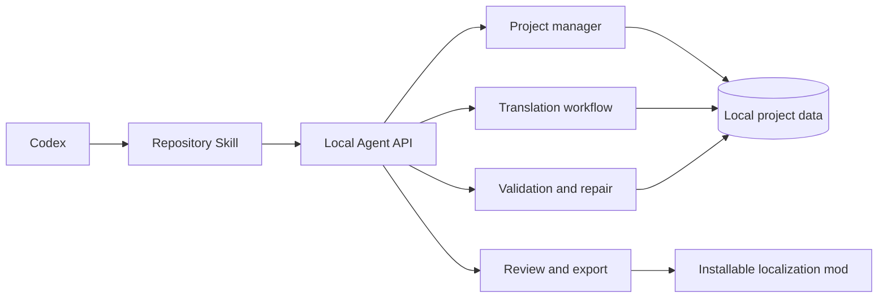

# OpenAI Build Week: Remis for Codex demo kit

## Submission description

Remis for Codex turns Codex into a production game-localization operator.
Users paste one instruction, and Codex installs or opens Remis, discovers its
repository Skill, checks the localhost API, inspects a Paradox mod, and guides a
governed translation workflow. Remis—not the Agent—owns parsing, terminology,
long-running state, validation, bounded repair, review, and export.

## Technical description

The integration adds a stable `/api/agent` facade over existing Remis project,
translation, validation, repair, and deployment services. Plans are
short-lived and approval-bound. Job metadata and audit events persist locally
without secrets. API responses normalize progress, validation summaries,
allowed actions, recovery state, and output paths so an Agent never needs to
infer whether work completed.

## Under-three-minute recording script

**0:00–0:20 — Problem and promise**

Show the `/codex` page. Say: “Game localization is not one prompt. Files,
terminology, variables, retries, validation, human review, and deployment all
have to agree. Remis already owns that workflow; Codex now becomes its natural
language control plane.”

**0:20–0:40 — One instruction**

Copy the install prompt and open Codex. Show discovery of
`.agents/skills/remis-agent/SKILL.md`, localhost health, and public
capabilities. Point out that no API key appears.
Show the live latest-release check. If provider setup is empty, let Codex
explain what an API key is and point to Remis Settings without asking for the
secret in chat.

**0:40–1:15 — Inspect and plan**

Ask: “Translate this Victoria 3 mod to Simplified Chinese, use the glossary,
and preserve every variable.” Show folder inspection, detected localization
files, and a translation plan. Reject it once to prove no side effect, then
approve.

**1:15–1:50 — Long-running state**

Show normalized progress and task recovery. Explain that Remis persists the
workflow instead of asking Codex to keep a fragile chat process alive.

**1:50–2:20 — Validation and repair**

Show errors, warnings, and human-review items separately. Approve safe repair.
Leave one ambiguous string for human review.

**2:20–2:45 — Export gate**

Show the export preview and overwrite warning. Approve only after the exact
target is visible.

**2:45–2:58 — Architecture close**

Return to the architecture section: “Codex is the natural-language control
plane. Remis is the reliable execution plane.”

## Recording checklist

- Use a fresh workspace with no provider secrets visible.
- Keep the service bound to `127.0.0.1`.
- Preload a deterministic small demo mod and glossary.
- Show at least one approval rejection and one approval acceptance.
- Show validation categories and one human-review item.
- Show the export preview before any write.
- Keep the final video under three minutes.
- Include the public repository, README, Skill path, issue, and `/codex` URL in
  the submission.
- Add the requested Codex Session ID to `/feedback` before submission.

## Demo validation checklist

- `GET /api/health` succeeds.
- Preflight checks the official latest GitHub Release before work.
- First-run preflight explains missing provider setup without exposing a key.
- Capabilities expose no key-like values.
- Import without approval returns `409 approval_required`.
- Paid translation without approval returns `409 approval_required`.
- Dry run creates no model call and no output.
- Repair without approval returns `409 approval_required`.
- Export outside Remis/game boundaries is rejected.
- Existing export requires a separate overwrite confirmation.
- Job state remains readable after in-memory task state is cleared.
- Website copy action works on desktop and mobile.
