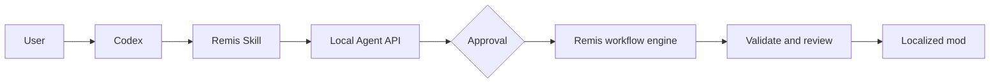

# Remis for Codex demo video production guide

## Production decision

Use a hybrid video: real product footage provides proof; restrained geometric
motion graphics provide orientation. Do not make a concept-only animation. The
viewer should see Remis and Codex working before the first minute ends.

**Target duration:** 2:40–2:50

**Language:** English voiceover with burned-in English captions

**Delivery:** flagship short-form product demo, 1080p, with no provider secrets
or personal paths

The core visual metaphor is simple:

```text
natural-language intent
        ↓
Codex + operator Skill
        ↓
localhost Agent API
        ↓
approval-bound Remis workflow
        ↓
validated, reviewable output
```

## Storyboard and narration

### 0:00–0:10 — Cold open: one request, governed delivery

**Picture**

A small user-intent circle enters a `Codex` node. The line passes through
`Skill`, `Plan`, and `Approval`, then expands into the Remis workflow before
ending at a green `Validated mod` tile. Keep the geometry flat and the labels
large.

**Voiceover**

> What if Codex could operate a complete production workflow without gaining
> uncontrolled access to your files, credentials, or deployment targets?

### 0:10–0:28 — The real problem

**Picture**

Show the live Remis for Codex page, then the desktop project's translation and
validation surfaces. Frame the capture above the supported-vendor logo rail
unless the intended publication permits those third-party marks.

**Voiceover**

> Game localization is not one prompt. Files, terminology, variables,
> checkpoints, retries, validation, human review, and deployment all have to
> agree. Remis already owns that workflow.

### 0:28–0:50 — Codex connects to the product

**Picture**

Show the real Codex task discovering
`.agents/skills/remis-agent/SKILL.md`. Show concise results from health,
preflight, and capability discovery. Crop the frame so no unrelated task names
or personal paths are visible.

**Voiceover**

> Remis for Codex makes Codex the natural-language control plane. A
> repository-discoverable Skill teaches the operating contract, while a typed
> localhost API exposes only bounded Remis capabilities. Preflight checks the
> release and provider state. No provider key appears in chat.

### 0:50–1:20 — Inspect and plan

**Picture**

Use `demo_agent_workshop`. Ask Codex to inspect the sample, preserve every
variable, and prepare a Simplified Chinese localization or repair plan. Show
the detected project state, intended operation, cost/write boundary, and
`allowed_actions`.

**Voiceover**

> I can ask for an outcome instead of navigating every tool. Codex inspects the
> sample through Remis and prepares a specific plan. Remis—not the model—owns
> parsing, glossary context, file boundaries, and execution.

### 1:20–1:40 — Prove the approval boundary

**Picture**

Reject the first plan and show that no task or output was created. Prepare it
again and approve the exact operation. If the full model call is too slow,
record the real approval and the later real persisted job as separate clips;
do not fabricate a result.

**Voiceover**

> Consequential work is plan-specific and approval-gated. Rejecting this plan
> produces no write. After approval, Remis starts the real workflow and records
> a durable job that survives the chat process.

### 1:40–2:05 — State, validation, and recovery

**Picture**

Show normalized progress, then a persisted or completed job. Open validation
evidence with errors, warnings, and at least one human-review item clearly
separated.

**Voiceover**

> Codex does not pretend that accepting a request means the work is complete.
> It reads persisted state, recovery information, validation categories, and
> output paths. Deterministic checks protect variables and structure, while
> ambiguous language stays with a person.

### 2:05–2:25 — Export is another decision

**Picture**

Show the export preview with the exact destination and overwrite state. Stop
at the approval gate, or approve only a disposable demo target.

**Voiceover**

> Translation approval is not deployment approval. Export shows the exact
> target and overwrite risk before Remis asks again. Models may propose and
> repair; Remis controls every write.

### 2:25–2:45 — Architecture and product close

**Picture**

Return to the five-node geometric architecture. Add small evidence labels:
`typed API`, `persistent jobs`, `deterministic validation`, `human approval`.
End on the repository and Windows release URLs.

**Voiceover**

> Codex understands the request and coordinates the workspace. Remis owns the
> durable state, validation, approvals, and every write. Natural-language
> control above a reliable execution plane. This is Remis for Codex.

## Capture manifest

Record clean source clips before animation or editing:

1. `/codex/` page hero and architecture section.
2. Remis desktop project or Agent Workshop screen.
3. Codex reading the Remis Skill.
4. `/api/health`, `/api/agent/preflight`, and `/api/agent/capabilities` results.
5. Inspection of `demo_agent_workshop`.
6. A complete plan with approval requirement and `allowed_actions`.
7. One real rejection with no side effect.
8. One real approval and resulting persisted task.
9. Progress or recovery state.
10. Validation categories and one human-review item.
11. Export preview and overwrite boundary.
12. Repository README, release link, and final product URL.

For long-running work, capture the start and final persisted state separately
and use an honest time cut. Do not animate a fake terminal response or present
a static mockup as a completed run.

## Motion-graphics direction

Keep Blender or SVG work intentionally small:

- flat orthographic camera;
- dark charcoal background with off-white type;
- Codex accent: cool green;
- Remis execution plane: teal/blue;
- approval gates: amber;
- validated output: restrained green;
- unsafe or rejected branch: muted red;
- circles for intent and Agents, rounded rectangles for contracts and systems;
- one left-to-right movement language throughout;
- no paragraph text inside the animation;
- total custom animation time below 25 seconds.

Use text labels and original geometric forms, not third-party logos, in custom
animation. Clear the rights for third-party trademarks, music, fonts, and
footage before publication.

The architecture should communicate hierarchy, not simulate a dashboard:



## Voice and captions

- Use a calm English synthetic voice at approximately 145–155 words per
  minute.
- Generate voice after the real clips are locked, then adjust pauses to the
  screen evidence.
- Burn concise English captions into the video and also upload an `.srt` file.
- Keep music optional and at least 18 dB below the narration.
- Pronounce Remis consistently as chosen by the project owner; record that
  pronunciation once before generating the full voice track.
- Audio must explicitly explain the roles of both **Codex** and **Remis**.

## Recording safety checklist

- [ ] Use a fresh demo workspace and a disposable export target.
- [ ] Keep the backend bound to `127.0.0.1`.
- [ ] Hide provider keys, tokens, emails, notifications, and unrelated task
      names.
- [ ] Crop or blur third-party trademarks unless their use in the submitted
      video is authorized.
- [ ] Avoid showing the full user-profile path where possible.
- [ ] Use the deterministic included sample and a known provider configuration.
- [ ] Run preflight before the workflow and report release-check failures
      honestly.
- [ ] Show at least one rejected and one accepted approval.
- [ ] Leave at least one ambiguous string for human review.
- [ ] Show export preview before any write.
- [ ] Show only capabilities actually exposed in the release being recorded.

## Final delivery checklist

- [ ] Duration is below 3:00; target 2:40–2:50.
- [ ] The project is visibly working before 1:00.
- [ ] Real product footage occupies most of the runtime.
- [ ] Voiceover explains the problem, architecture, safety boundary, and why
      Codex delegates execution to Remis.
- [ ] Captions are readable on a phone-sized YouTube player.
- [ ] Repository and product links remain visible for at least three seconds.
- [ ] Publication visibility matches the intended portfolio or product use.
- [ ] Public playback was verified while signed out of the hosting platform.
- [ ] Music, fonts, footage, and marks are original, licensed, or otherwise
      authorized for the submission.
- [ ] The final URL was added to the product page, README, or portfolio entry.
