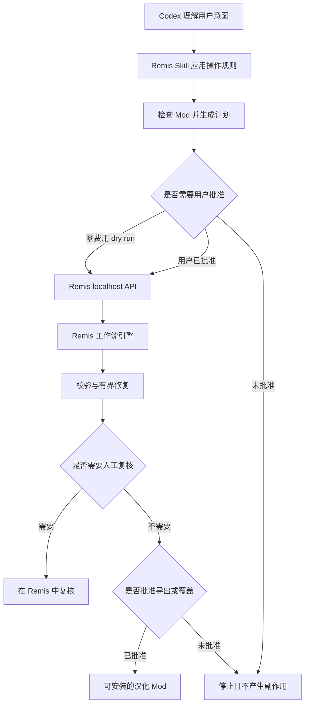

# Remis for Codex：Agent API 快速开始

Remis 是可靠的游戏本地化执行层。Codex 是自然语言控制层：理解工作区、解释计划、调用本机 API，并在安全门槛前停下来等待用户决定。

Skill 只是 Agent 的操作说明书。真正完成工作的仍然是 Remis 桌面应用、FastAPI 服务、工作流引擎、校验与修复系统、项目存储，以及人工复核和导出界面。

## 安装操作 Skill

把下面这段话交给你的 Agent：

> 从 https://github.com/Drlinglong/Remis clone 并安装 Remis，阅读仓库内的 Agent Skill，在本机启动并确认可以使用。安装成功后告诉我 Remis 已就绪。然后简要说明：OpenAI、Google 等外部供应商需要 API key 才能使用其服务；API key 是可能关联计费的私密访问凭据，只能填写在 Remis 设置 → API 设置中，不能贴进对话。LM Studio、Ollama 等本地 Provider 不需要 API key。

Codex 会从下面的位置发现仓库 Skill：

```text
.agents/skills/remis-agent/SKILL.md
```

## 检查本地服务

启动已安装的桌面应用，或者从仓库根目录运行
`scripts\developer_tools\windows\run-dev.bat`。默认端口为 `1453`；如果启动器通过
`REMIS_BACKEND_PORT` 打印了其他端口，以实际端口为准。然后检查：

```powershell
Invoke-RestMethod http://127.0.0.1:1453/api/health
Invoke-RestMethod http://127.0.0.1:1453/api/agent/preflight
Invoke-RestMethod http://127.0.0.1:1453/api/agent/capabilities
```

能力接口只返回可公开的游戏、语言、Provider 与工作流信息，不会返回 Provider 密钥。

选择游戏前先读取 `games[].game_support`。调用
`POST /api/agent/projects/inspect` 时可提供 `game_id`、`source_language` 和
扫描提示 `game_version`；响应会给出识别资源范围与诊断。`game_version` 只用于本次扫描，
不会写入项目配置或改变后续任务参数。导入后可调用
`GET /api/agent/projects/{project_id}/game-support` 扫描项目当前源目录；导入计划和翻译计划也会携带
`game_support`，审批前应查看其中的诊断。

每次开始新工作流之前都要调用 `preflight`。它会实时检查官方 GitHub 的最新 Release，并报告 Provider 设置是否缺失。首次安装后，应先在 **Remis 设置 > API 设置** 中配置云端 Provider 密钥，或者明确选择并测试一个无需密钥的本地 Provider。API key 是模型 Provider 发放的秘密凭据，用于身份认证，通常也关联计费；它应该只填进 Remis，不能贴到 Agent 对话里。

## 受控调用流程



详细 payload、状态和错误语义见
`.agents/skills/remis-agent/references/api-workflow.md`。

## 信任边界

- **只监听本机：** Remis 默认绑定本地地址。
- **密钥留在 Remis：** Agent 响应和能力发现都不会包含模型 API key。
- **工作前检查版本：** 每次 Agent 工作流都先对照官方 GitHub Release 检查当前安装版本。
- **花钱前批准：** 真正调用模型的翻译必须使用对应计划的明确批准。
- **模型修复前批准：** 模型修复是独立的费用与写操作门槛。
- **导出前批准：** 先展示目标路径、风险和覆盖状态，再允许部署。
- **输出必须校验：** 游戏变量、语法、编码和目录结构继续接受确定性检查。
- **操作可追踪：** 计划、任务、修复、批准和可恢复快照保存在本机 Remis 数据中。

## 多游戏工作流边界

`POST /api/agent/jobs/plan` 支持 `workflow: "initial"`（默认）和
`workflow: "incremental"`。增量流程比较已识别的条目；仅版本号或路径变化不会触发整批重译。原文变化时保留已有译文并标记待复核，`needs_review` 在人工确认前不算已解决。`dry_run` 只检查就绪状态，不执行条目差异计算。Project Zomboid 和 RimWorld 当前不支持增量 checkpoint 恢复或自定义套壳语言；请重新创建增量计划。

Project Zomboid 支持 JSON 字符串映射及受限的字面量 Lua 表 TXT。RimWorld 支持 Keyed、DefInjected、Strings、规则目录明确列出的 Def 可翻译字段和 `rulesStrings`。这表示适配器能识别这些格式，不代表覆盖 Mod 的所有文件；未知字段及依赖运行时的内容会产生诊断或交由人工复核。源文件只读；每个目标语言生成独立包，导出预览只列出现有本地产物供手动安装。预览的 `validation_scope` 是 `artifact_presence_only`，不代表游戏运行时已验证。对于以明确批准方式调用的 Paradox 导出请求，这三款游戏均返回 `409 unsupported_game_deployment`。Surviving Mars 沿用现有 ModItemLocTable CSV 初次翻译、增量更新和校对流程；另可用 translation-package options/plan/export API 把已有 CSV 译文生成本地独立轻量包，须审批且不会自动安装、发布或复制原 Mod 资产。硬编码 `Untranslated(...)` 文本不在 CSV 覆盖范围内，包的 `runtime_verified` 为 false。

详细响应字段见 [Agent API 技术参考](../../../.agents/skills/remis-agent/references/api-workflow.md)，玩家说明见[多游戏本地化指南](../user-guides/multi-game-localization.md)。

Agent API 对支持部署的游戏仍提供审批门控的导出，并为适用任务提供协作式取消；取消不是立即杀死进程。暂停仍不支持，因为当前 runner 没有安全的协作式暂停点。

服务运行时可在 `http://127.0.0.1:1453/docs` 查看交互式 API 文档。
