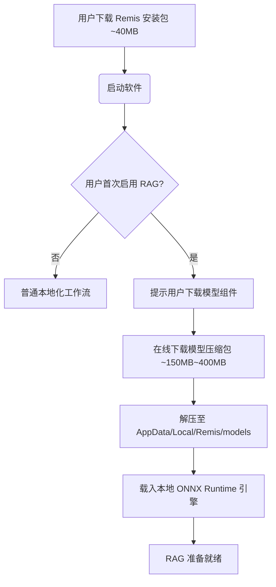

# Remis RAG 系统架构与模型选型方案

本篇文档记录了为 Remis 项目技术文档量身定制的 RAG (检索增强生成) 系统的技术选型与工程架构设计。

该方案旨在兼顾**极客玩家/开发者的高性能本地算力（如 RTX 5090）**与**普通无 GPU 用户的零开销本地运行需求**，实现“本地与云端双轨制”的兼容性设计。

---

## 一、 整体设计理念

在 RAG 系统中，核心痛点是 **“向量库与模型强绑定”**：一旦文档被某种向量化模型（Embedding）转化为向量，查询时就必须使用完全一致的模型进行计算，否则检索空间无法匹配。而重排序模型（Reranker）是动态打分的，无需与数据库绑定，可以灵活降级。

基于此特性，Remis 的 RAG 采用以下设计原则：
1. **统一 Embedding 空间**：所有用户（本地或云端）统一使用同一款 Embedding模型，以实现生成的知识库索引能够无缝分发和共享。
2. **解耦并动态调整 Reranker**：提供不同档位的 Reranker 模型，高性能设备使用大参数重排，低端设备使用 CPU 级别重排，或直接关闭重排进行降级。
3. **延迟加载（Lazy Loading）模型**：客户端安装包（~40MB）不内置模型权重，而是由用户在首次启用 RAG 时按需下载，避免安装包体积暴增。

---

## 二、 模型选型与运行模式

### 1. 向量化模型 (Embedding) 选型

为了兼顾长文本、多语言与 CPU 推理效率，我们选择 **`BAAI/bge-m3`** 作为系统默认的向量化模型。同时提供 **`bge-small-zh-v1.5`** 作为极轻量化备选。

| 模型 | 参数量 | 量化格式 | 模型体积 | 适用场景 / 性能表现 |
| :--- | :--- | :--- | :--- | :--- |
| **`bge-m3`** *(默认)* | 567M | INT8 (ONNX) | ~560 MB | **全功能版**。支持 8k 长度，混合检索（Dense/Sparse/ColBERT），普通 CPU 下单次 Query 向量化约 **20-50ms**。 |
| **`bge-small-zh-v1.5`** | 24M | INT8 (ONNX) | ~24 MB | **极轻量版**。适合极速下载或对存储非常敏感的设备，长文本能力偏弱但短文本检索性能优异。 |

### 2. 重排序模型 (Reranker) 选型

重排序模型负责从向量检索召回的前 20 个文档分块中剔除噪点，按相关性精准排序。

| 档位 | 推荐模型 | 参数量 | 运行后端 | 显存 / 内存开销 | 延迟性能 |
| :--- | :--- | :--- | :--- | :--- | :--- |
| **尊贵版** | `bge-reranker-v2-gemma2-9b` | 9B | 本地 GPU (如 5090) | ~9 GB 显存 (INT8) | < 100ms (5090 CUDA) |
| **平民版** | `bge-reranker-base` | 278M | 本地 CPU (ONNX) | ~270 MB 内存 | ~100-300ms (CPU) |
| **云端 API** | `bge-reranker-large` | 335M | SiliconFlow 等 API | 无本地硬件要求 | 取决于网络 (约 200ms) |
| **降级版** | 无 (关闭重排序) | - | - | 无 | 0ms |

---

## 三、 客户端工程与打包体积控制

由于量化模型和依赖库的体积较大，直接内置到 Remis 客户端（目前安装包约 40MB）会导致体积增大十倍。因此采用**按需延迟下载方案**：



### 1. 软件打包内容
* **内置**：`onnxruntime.dll` / 动态库（约 20MB），以便支持所有本地 CPU 推理，避免用户安装复杂的 Python 依赖。
* **不内置**：所有的 `.onnx` 模型权重文件。

### 2. 运行时配置结构 (示例)
```json
{
  "rag": {
    "embedding": {
      "model": "BAAI/bge-m3",
      "provider": "local_cpu"
    },
    "reranker": {
      "enable": true,
      "provider": "local_cpu", 
      "model": "bge-reranker-base",
      "top_n_input": 20,
      "top_n_output": 5
    }
  }
}
```

---

## 四、 共享知识库分发设计

通过在 Remis 中统一 `bge-m3` 的向量空间：
1. **预构建索引分发**：项目维护者可以在拥有高性能 GPU 的设备上，将 Remis 官方的技术文档及 API 手册预先跑一遍 Embedding，构建好 SQLite-vec 格式的向量库单文件。
2. **零开销检索**：将该向量库文件直接打包发布。普通用户的 Remis 客户端在检索时，本地 CPU 仅需花几毫秒向量化自己的提问句，即可直接在这份官方预建的数据库中进行高速检索。
